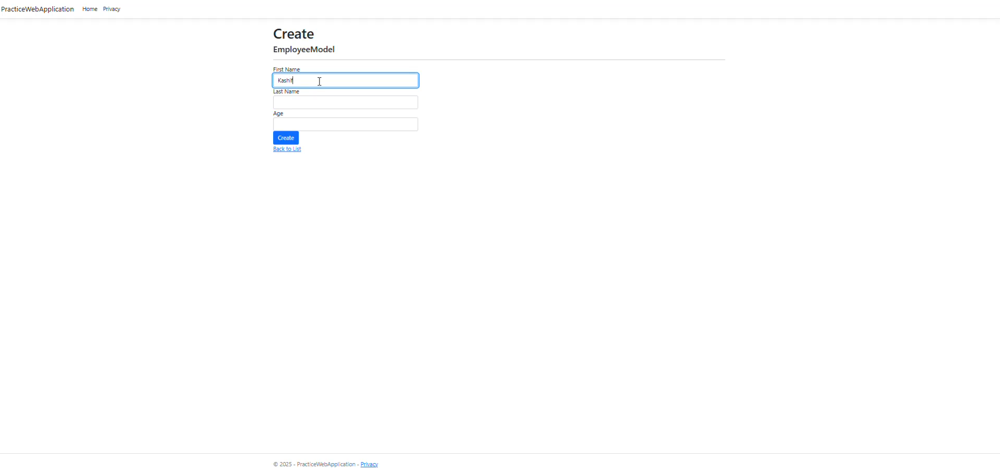

# ASP.NET Core CRUD Application

A full-featured CRUD (Create, View, Update, Delete) web application built with ASP.NET Core using Razor Pages and Entity Framework Core scaffolding.

## Features

- **Create**: Add new records to the database
- **View**: View and search through existing records
- **Update**: Edit and modify existing records
- **Delete**: Remove records from the database
- Responsive web interface using Bootstrap
- Server-side validation
- Entity Framework Core for data access
- Scaffolded Razor Pages for rapid development
- SQL Server database integration

## Technologies Used

- **ASP.NET Core 8.0** (or your specific version)
- **Razor Pages**
- **Entity Framework Core**
- **SQL Server** (or your database provider)
- **Bootstrap 5** for responsive UI
- **C#**
- **HTML/CSS/JavaScript**

## Prerequisites

Before running this application, make sure you have the following installed:

- [.NET 8.0 SDK](https://dotnet.microsoft.com/download) (or your specific version)
- [Visual Studio 2022](https://visualstudio.microsoft.com/) or [Visual Studio Code](https://code.visualstudio.com/)
- [SQL Server](https://www.microsoft.com/en-us/sql-server/sql-server-downloads) (LocalDB, Express, or full version)
- [SQL Server Management Studio](https://docs.microsoft.com/en-us/sql/ssms/download-sql-server-management-studio-ssms) (optional, for database management)

## Installation

1. **Clone the repository**
   ```bash
   git clone https://github.com/yourusername/your-crud-app.git
   cd your-crud-app
   ```

2. **Restore NuGet packages**
   ```bash
   dotnet restore
   ```

3. **Build the project**
   ```bash
   dotnet build
   ```

## Database Setup

1. **Update the connection string**
   
   Open `appsettings.json` and update the connection string to match your SQL Server instance:
   ```json
   {
     "ConnectionStrings": {
       "DefaultConnection": "Server=(localdb)\\mssqllocaldb;Database=YourAppDb;Trusted_Connection=true;MultipleActiveResultSets=true;TrustServerCertificate=true;"
     }
   }
   ```

2. **Run Entity Framework migrations**
   ```bash
   dotnet ef database update
   ```

   If migrations don't exist, create them first:
   ```bash
   dotnet ef migrations add InitialCreate
   dotnet ef database update
   ```

## Running the Application

1. **Run the application**
   ```bash
   dotnet run
   ```

2. **Access the application**
   
   Open your web browser and navigate to:
   - `https://localhost:5001` (HTTPS)
   - `http://localhost:5000` (HTTP)

# Project Structure - PracticeWebApplication

```
PracticeWebApplication/
├── Connected Services/
├── Dependencies/
├── Properties/
├── wwwroot/
├── Controllers/
│   └── HomeController.cs
├── Migrations/
├── Models/
│   ├── EmployeeDbContext.cs
│   ├── EmployeeModel.cs
│   └── ErrorViewModel.cs
├── Views/
│   ├── Home/
│   │   ├── Create.cshtml
│   │   ├── Delete.cshtml
│   │   ├── Details.cshtml
│   │   ├── Edit.cshtml
│   │   ├── Index.cshtml
│   │   └── Privacy.cshtml
│   └── Shared/
│       ├── _ViewImports.cshtml
│       └── _ViewStart.cshtml
├── .gitattributes
├── .gitignore
├── appsettings.json
├── Program.cs
└── README.md
```
## Key Components

### Controllers
- **HomeController.cs** - Main controller handling home page and employee-related actions

### Models
- **EmployeeDbContext.cs** - Entity Framework database context for employee data
- **EmployeeModel.cs** - Employee entity model
- **ErrorViewModel.cs** - Model for error handling and display

### Views
- **Home Views** - Complete set of CRUD operation views:
  - `Index.cshtml` - Main listing page
  - `Create.cshtml` - Employee creation form
  - `Edit.cshtml` - Employee editing form
  - `Details.cshtml` - Employee details view
  - `Delete.cshtml` - Employee deletion confirmation
  - `Privacy.cshtml` - Privacy policy page

### Configuration
- **appsettings.json** - Application configuration settings
- **Program.cs** - Application entry point and configuration
- **.gitignore** / **.gitattributes** - Git configuration files

### Database
- **Migrations/** - Entity Framework database migration files

This structure follows standard ASP.NET Core MVC conventions with a clear separation of concerns between models, views, and controllers.

## Usage

### Creating Records
1. Navigate to the main page
2. Click "Create New" button
3. Fill in the required fields
4. Click "Create" to save the record

### Viewing Records
- The main page displays a list of all records
- Click "Details" to view complete information for a specific record

### Updating Records
1. Click "Edit" next to the record you want to modify
2. Update the necessary fields
3. Click "Save" to apply changes

### Deleting Records
1. Click "Delete" next to the record you want to remove
2. Confirm the deletion on the confirmation page

## API Endpoints

The application uses Razor Pages, but the following page routes are available:

- `GET /Home` - List all records
- `GET /Home/Create` - Show create form
- `POST /Home/Create` - Create new record
- `GET /Home/Details/{id}` - Show record details
- `GET /Home/Edit/{id}` - Show edit form
- `POST /Home/Edit/{id}` - Update record
- `GET /Home/Delete/{id}` - Show delete confirmation
- `POST /Home/Delete/{id}` - Delete record

## Configuration

### Database Configuration
Update the connection string in `appsettings.json` to point to your database server.

### Environment Settings
The application supports different environments (Development, Staging, Production). Use `appsettings.{Environment}.json` files for environment-specific settings.

## Troubleshooting

### Common Issues

1. **Database Connection Errors**
   - Verify your connection string is correct
   - Ensure SQL Server is running
   - Check if the database exists

2. **Migration Errors**
   - Delete the Migrations folder and recreate migrations
   - Ensure your model classes are properly configured

3. **Build Errors**
   - Run `dotnet clean` followed by `dotnet build`
   - Check for missing NuGet packages


[](https://ahmed-sial.github.io/aspnet-core-crud-app/)
